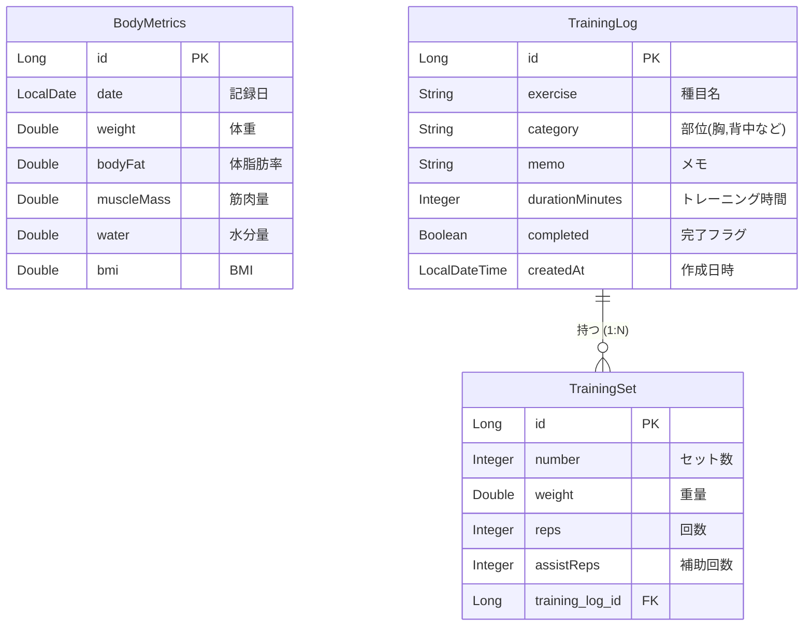

# 筋トレ記録くん

日々のトレーニングにおけるコンディション、種目別の重量・回数、カレンダーでの履歴確認を行うためのSpring Boot製Webアプリケーションです。

##  開発の目的と背景
自身の筋トレを管理するアプリを自作することで、バックエンド（Java/Spring Boot）の基本構造とデータベースの連携を学ぶことを目的としました。
本プロジェクトは、すべてのコードをゼロから自力で記述したものではありません。生成AI（Gemini）をコーディングパートナーとして活用し、実装したい要件を伝え、提案されたコードを環境に組み込み、エラーを解決していく「AI駆動開発」の形式で構築しています。

##  使用技術
* **バックエンド**: Java 21 / Spring Boot
* **フロントエンド**: HTML / Thymeleaf / JavaScript / Bootstrap 5
* **データベース**: H2 Database (またはMySQLなど) / Spring Data JPA

##  データベース設計 (ER図)
日付を軸とした「身体指標」と、トレーニングの親（ログ）子（セット）関係を構築しています。

AIが生成したコードを単にコピーするだけでなく、システムとして統合し、動作させる過程で以下の課題解決に取り組みました。

1.システムエラー（500エラー）の切り分けと解決

直面した壁: 編集画面への遷移時にパースエラーが発生し、システムがクラッシュしました。

解決へのアプローチ: 画面のエラー文とログを確認してAIに状況を正確に伝達しました。Thymeleafの仕様によるフォーマット不一致が原因であると特定し、Java側でデータをJSON文字列化して安全に渡す設計への変更をAIに指示・適用して解決しました。

2.不要な依存関係の競合排除

直面した壁: 初期に導入したログイン機能（Spring Security）の影響で、画面が無限にリダイレクトされるループが発生しました。

解決へのアプローチ: コード内の修正だけでなく、設定ファイル（build.gradle）から不要な依存関係を解除し、プロジェクトのクリーンアップと関連ファイルの削除を行うことで、根本的な原因を排除しました。

自力で解決できないエラーに対して、現状を正確に言語化してAIに伝え、提案された解決策をローカル環境に適用して検証し切る力を実践的に学びました。
